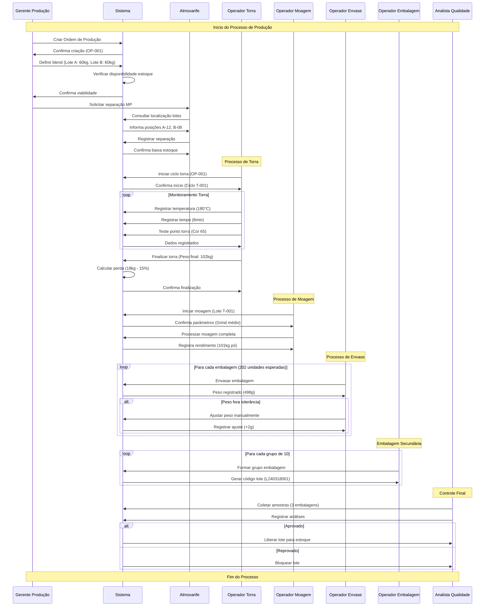
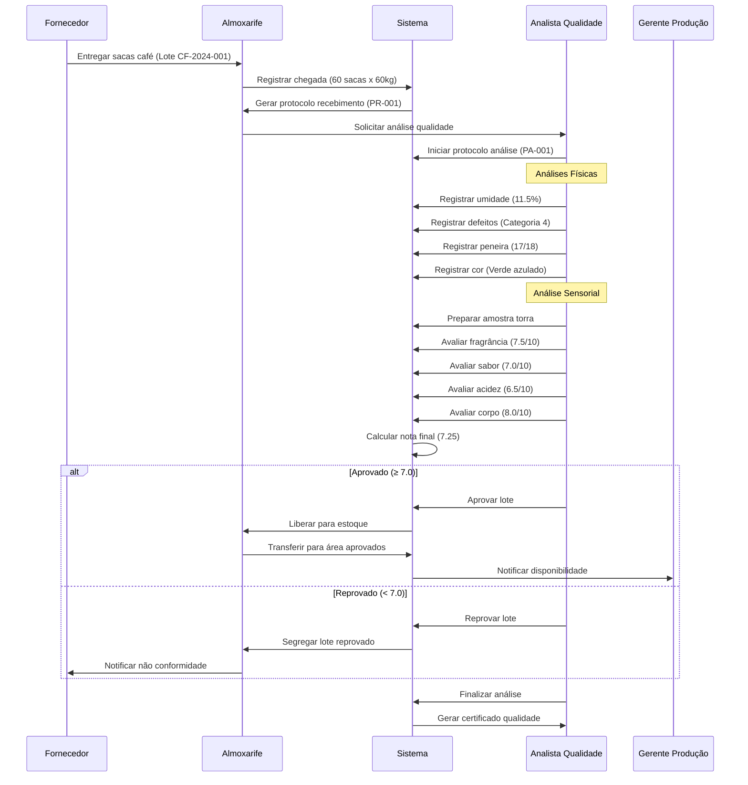
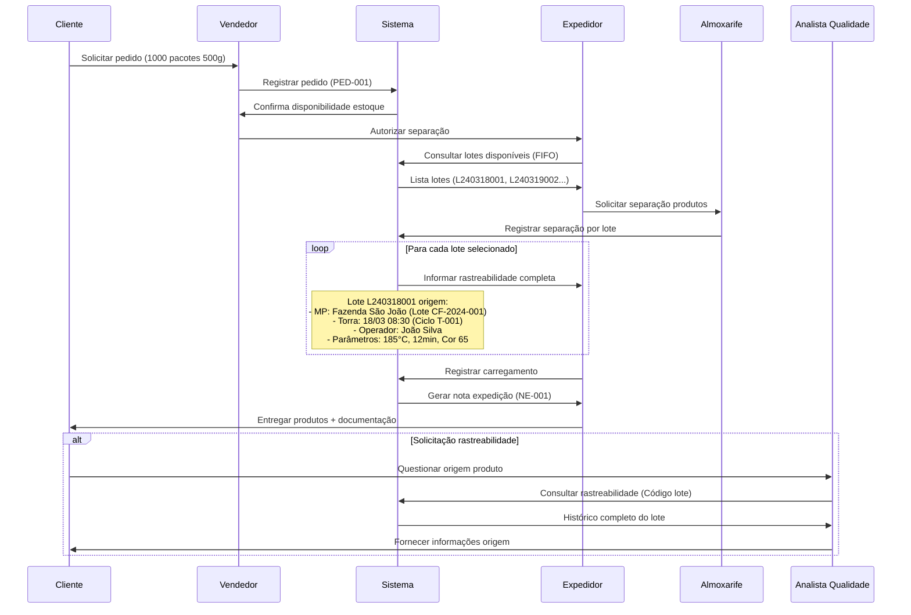
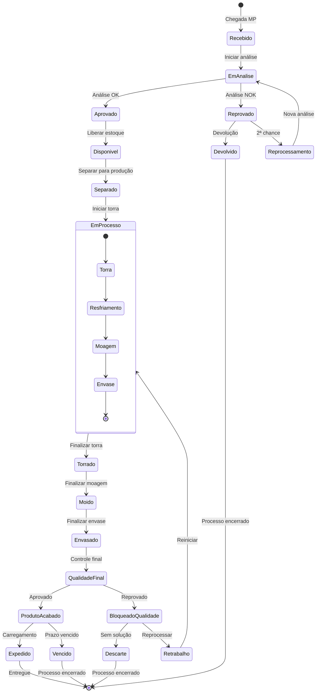

# Desafio: Sistema de Gerenciamento de Torrefação de Café

## Objetivo do Desafio

Desenvolver um **Modelo Entidade-Relacionamento (MER/DER)** completo para um sistema de gerenciamento de uma torrefação de café, considerando todos os aspectos operacionais, de qualidade, estoque, rastreabilidade e controle de produção.

---

## 1. Descrição do Negócio

A **Torrefação e Moagem de Café Acme Ltda.** é uma empresa especializada no beneficiamento e comercialização de café torrado e moído. A empresa adquire café em grãos crus de diversos fornecedores e realiza todo o processo de transformação até o produto final: embalagens de 500g de café em pó.

### 1.1 Processo Produtivo Detalhado

O processo produtivo segue uma sequência rigorosa de etapas:

**Etapa 1: Recebimento e Armazenagem**

- Café cru chega em sacas de 60kg
- Cada lote possui características específicas (origem, safra, tipo, umidade, defeitos)
- Sacas são identificadas e armazenadas por lote
- Controle de qualidade inicial avalia cada lote

**Etapa 2: Preparação para Torra**

- Seleção de sacas baseada na demanda e perfil de torra desejado
- Carregamento de exatamente 2 sacas (120kg) no torrador
- Registro da composição do blend (se houver mistura de lotes)

**Etapa 3: Processo de Torra**

- Torrador opera com ciclos de torra específicos
- Operador monitora continuamente através de pontos de teste
- Parâmetros controlados: temperatura, tempo, cor, desenvolvimento
- Registro de todas as medições durante o processo

**Etapa 4: Resfriamento e Estabilização**

- Café torrado despejado em peneira para resfriamento
- Tempo de resfriamento controlado
- Pesagem para cálculo de perda na torra (quebra)

**Etapa 5: Transporte e Moagem**

- Elevador transporta café para container intermediário
- Container alimenta moega de moagem automaticamente
- Regulagem da granulometria conforme especificação
- Pó resultante segue para container de envase

**Etapa 6: Envase Primário**

- Máquina enche embalagens de 500g (com variação de peso)
- Cada embalagem recebe identificação automática
- Registro de data/hora, lote e operador

**Etapa 7: Controle de Peso**

- Pesagem individual de cada embalagem
- Ajuste manual do peso quando necessário
- Registro de conformidade/não-conformidade

**Etapa 8: Selagem**

- Selagem individual das embalagens
- Controle de integridade da selagem
- Aplicação de rótulos e códigos de rastreabilidade

**Etapa 9: Formatação e Embalagem Secundária**

- Formatação das embalagens individuais
- Agrupamento de 10 unidades (totalizando 5kg)
- Embalagem em sacos maiores com identificação

**Etapa 10: Armazenagem e Expedição**

- Transferência para área de produtos acabados
- Controle de estoque por lote e data de fabricação
- Carregamento em caminhões conforme pedidos

---

## 2. Levantamento de Requisitos

### 2.1 Requisitos Funcionais

#### RF001 - Gestão de Fornecedores e Matéria-Prima

- O sistema deve cadastrar fornecedores com dados completos
- Deve registrar todas as características do café cru adquirido
- Deve controlar lotes de matéria-prima por origem, safra e qualidade
- Deve gerenciar contratos de fornecimento

#### RF002 - Controle de Qualidade de Entrada

- Deve registrar análises físicas e sensoriais do café cru
- Deve permitir aprovação/reprovação de lotes
- Deve manter histórico de qualidade por fornecedor
- Deve calcular índices de qualidade e classificação

#### RF003 - Gestão de Estoque de Matéria-Prima

- Deve controlar entrada, saída e saldo por lote
- Deve rastrear localização física das sacas
- Deve alertar sobre vencimentos e rotatividade
- Deve calcular custos médios por lote

#### RF004 - Planejamento de Produção

- Deve permitir criar ordens de produção
- Deve definir composição de blends
- Deve calcular necessidades de matéria-prima
- Deve programar uso de equipamentos

#### RF005 - Controle do Processo de Torra

- Deve registrar parâmetros de cada ciclo de torra
- Deve controlar perfis de torra por produto
- Deve registrar intervenções do operador
- Deve calcular rendimentos e perdas

#### RF006 - Gestão de Equipamentos

- Deve cadastrar todos os equipamentos
- Deve controlar manutenções preventivas e corretivas
- Deve registrar paradas e tempos de setup
- Deve monitorar eficiência operacional

#### RF007 - Controle de Processo de Moagem

- Deve registrar parâmetros de moagem
- Deve controlar granulometria
- Deve rastrear lotes através do processo
- Deve calcular rendimentos

#### RF008 - Controle de Envase e Pesagem

- Deve registrar peso de cada embalagem
- Deve controlar ajustes de peso
- Deve identificar não-conformidades
- Deve rastrear operadores por turno

#### RF009 - Gestão de Qualidade de Produto Acabado

- Deve realizar controle estatístico de processo
- Deve registrar análises de produto final
- Deve controlar especificações por cliente
- Deve gerenciar não-conformidades

#### RF010 - Controle de Estoque de Produto Acabado

- Deve controlar entrada, saída e saldo
- Deve rastrear por lote e validade
- Deve gerenciar FIFO (primeiro que entra, primeiro que sai)
- Deve integrar com expedição

#### RF011 - Rastreabilidade Completa

- Deve rastrear da matéria-prima ao produto final
- Deve permitir rastreamento bidirecional
- Deve manter histórico completo de transformações
- Deve atender regulamentações sanitárias

#### RF012 - Gestão de Pedidos e Vendas

- Deve registrar pedidos de clientes
- Deve controlar entregas e faturamento
- Deve gerenciar devoluções
- Deve calcular margens e rentabilidade

#### RF013 - Controle de Custos

- Deve calcular custos por etapa do processo
- Deve ratear custos indiretos
- Deve controlar perdas e retrabalhos
- Deve gerar relatórios de custos

#### RF014 - Gestão de Recursos Humanos

- Deve cadastrar funcionários por função
- Deve controlar turnos e escalas
- Deve registrar treinamentos
- Deve avaliar produtividade

#### RF015 - Relatórios e Indicadores

- Deve gerar relatórios operacionais
- Deve calcular indicadores de performance
- Deve permitir análises históricas
- Deve suportar exportação de dados

### 2.2 Requisitos Não-Funcionais

#### RNF001 - Performance

- Tempo de resposta máximo: 3 segundos para consultas
- Suporte a até 100 usuários simultâneos
- Disponibilidade: 99,5% durante horário comercial

#### RNF002 - Segurança

- Controle de acesso por perfil de usuário
- Log de auditoria para todas as operações
- Backup automático diário

#### RNF003 - Usabilidade

- Interface intuitiva para operadores de chão de fábrica
- Suporte a dispositivos móveis para coleta de dados
- Multilíngue (português/espanhol)

#### RNF004 - Integração

- API para integração com sistemas ERP
- Protocolo de comunicação com equipamentos industriais
- Exportação para sistemas de qualidade

---

## 3. Atores do Sistema

### 3.1 Atores Principais

- **Gerente de Produção**: Planeja e coordena toda a produção
- **Operador de Torra**: Executa e monitora processo de torra
- **Operador de Moagem**: Controla processo de moagem
- **Operador de Envase**: Executa envase e controle de peso
- **Operador de Embalagem**: Realiza selagem e embalagem secundária
- **Analista de Qualidade**: Executa controles de qualidade
- **Almoxarife**: Controla estoques e movimentações
- **Expedidor**: Gerencia entregas e carregamentos

### 3.2 Atores Secundários

- **Comprador**: Gerencia aquisições de matéria-prima
- **Vendedor**: Processa pedidos e atende clientes
- **Mantenedor**: Executa manutenções em equipamentos
- **Supervisor**: Supervisiona operações por turno
- **Administrador do Sistema**: Gerencia usuários e sistema

---

## 4. Histórias de Usuário

### História 1: Recebimento de Matéria-Prima

**Como** almoxarife
**Eu quero** registrar o recebimento de sacas de café cru
**Para que** eu possa controlar o estoque e garantir rastreabilidade

**Critérios de Aceitação:**

- Deve registrar fornecedor, lote, quantidade, data de chegada
- Deve capturar características do café (origem, variedade, processo)
- Deve gerar etiquetas de identificação
- Deve atualizar saldo em estoque

### História 2: Análise de Qualidade de Entrada

**Como** analista de qualidade
**Eu quero** registrar análises do café cru recebido
**Para que** eu possa aprovar ou rejeitar lotes conforme padrões

**Critérios de Aceitação:**

- Deve registrar análises físicas (umidade, defeitos, granulometria)
- Deve registrar análise sensorial (aroma, sabor, corpo)
- Deve permitir aprovação/reprovação com justificativa
- Deve gerar certificado de qualidade

### História 3: Planejamento de Torra

**Como** gerente de produção
**Eu quero** criar ordens de produção definindo blend e quantidade
**Para que** eu possa otimizar o uso de matéria-prima e atender demanda

**Critérios de Aceitação:**

- Deve permitir seleção de lotes para composição do blend
- Deve calcular proporções e quantidades necessárias
- Deve verificar disponibilidade em estoque
- Deve gerar lista de separação para produção

### História 4: Controle de Processo de Torra

**Como** operador de torra
**Eu quero** registrar todos os parâmetros durante a torra
**Para que** eu possa garantir qualidade e rastreabilidade do processo

**Critérios de Aceitação:**

- Deve registrar temperatura inicial, máxima e final
- Deve registrar tempo total de torra
- Deve permitir anotações sobre desenvolvimento
- Deve calcular perda de peso automaticamente

### História 5: Controle de Peso no Envase

**Como** operador de envase
**Eu quero** registrar o peso real de cada embalagem
**Para que** eu possa identificar e corrigir desvios de peso

**Critérios de Aceitação:**

- Deve capturar peso via balança integrada
- Deve sinalizar quando peso está fora da tolerância
- Deve permitir ajuste manual do peso
- Deve registrar todas as correções realizadas

### História 6: Rastreabilidade de Produto

**Como** analista de qualidade
**Eu quero** rastrear um produto final até sua origem
**Para que** eu possa identificar causas de problemas de qualidade

**Critérios de Aceitação:**

- Deve mostrar lotes de matéria-prima utilizados
- Deve mostrar parâmetros de processamento
- Deve mostrar operadores envolvidos em cada etapa
- Deve mostrar datas e horários de cada processo

### História 7: Controle de Estoque

**Como** almoxarife
**Eu quero** consultar saldos e movimentações de estoque
**Para que** eu possa controlar disponibilidade e rotatividade

**Critérios de Aceitação:**

- Deve mostrar saldo atual por lote
- Deve mostrar histórico de movimentações
- Deve calcular tempo médio de estoque
- Deve alertar sobre lotes próximos ao vencimento

### História 8: Expedição de Produtos

**Como** expedidor
**Eu quero** registrar carregamentos de produtos acabados
**Para que** eu possa controlar entregas e atualizar estoque

**Critérios de Aceitação:**

- Deve selecionar lotes seguindo critério FIFO
- Deve registrar veículo, motorista e destino
- Deve gerar nota de expedição
- Deve baixar produtos do estoque

---

## 5. Diagrama de Casos de Uso

```mermaid
graph TB
    %% Atores
    GP[Gerente de Produção]
    OT[Operador de Torra]
    OM[Operador de Moagem]
    OE[Operador de Envase]
    OEM[Operador de Embalagem]
    AQ[Analista de Qualidade]
    ALM[Almoxarife]
    EXP[Expedidor]
    COMP[Comprador]

    %% Casos de Uso Principais
    subgraph "Sistema de Gestão de Torrefação"
        %% Gestão de Matéria-Prima
        UC01[Cadastrar Fornecedor]
        UC02[Registrar Recebimento]
        UC03[Analisar Qualidade Entrada]
        UC04[Controlar Estoque MP]

        %% Planejamento e Produção
        UC05[Planejar Produção]
        UC06[Criar Ordem de Produção]
        UC07[Definir Blend]
        UC08[Separar Matéria-Prima]

        %% Processo de Torra
        UC09[Iniciar Ciclo de Torra]
        UC10[Monitorar Torra]
        UC11[Registrar Parâmetros]
        UC12[Finalizar Torra]

        %% Processo de Moagem
        UC13[Configurar Moagem]
        UC14[Processar Moagem]
        UC15[Controlar Granulometria]

        %% Processo de Envase
        UC16[Envasar Produto]
        UC17[Controlar Peso]
        UC18[Ajustar Peso]
        UC19[Selar Embalagens]

        %% Embalagem Secundária
        UC20[Formatar Embalagens]
        UC21[Embalar Secundário]
        UC22[Identificar Lotes]

        %% Controle de Qualidade
        UC23[Analisar Produto Final]
        UC24[Controlar Processo]
        UC25[Gerenciar NC]

        %% Estoque e Expedição
        UC26[Controlar Estoque PA]
        UC27[Expedir Produtos]
        UC28[Rastrear Produtos]

        %% Gestão de Equipamentos
        UC29[Manter Equipamentos]
        UC30[Controlar Paradas]

        %% Relatórios
        UC31[Gerar Relatórios]
        UC32[Calcular Indicadores]
    end

    %% Relacionamentos
    GP --> UC05
    GP --> UC06
    GP --> UC07
    GP --> UC31
    GP --> UC32

    COMP --> UC01
    COMP --> UC02

    ALM --> UC02
    ALM --> UC04
    ALM --> UC08
    ALM --> UC26

    AQ --> UC03
    AQ --> UC23
    AQ --> UC24
    AQ --> UC25
    AQ --> UC28

    OT --> UC09
    OT --> UC10
    OT --> UC11
    OT --> UC12

    OM --> UC13
    OM --> UC14
    OM --> UC15

    OE --> UC16
    OE --> UC17
    OE --> UC18
    OE --> UC19

    OEM --> UC20
    OEM --> UC21
    OEM --> UC22

    EXP --> UC27
    EXP --> UC28

    %% Relacionamentos de Inclusão e Extensão
    UC05 -.-> UC06
    UC06 -.-> UC07
    UC07 -.-> UC08
    UC09 -.-> UC10
    UC10 -.-> UC11
    UC11 -.-> UC12
    UC16 -.-> UC17
    UC17 -.-> UC18
```

---

## 6. Diagramas de Sequência

### 6.1 Sequência: Processo Completo de uma Batelada

### 6.2 Sequência: Controle de Qualidade de Entrada

### 6.3 Sequência: Expedição e Rastreabilidade

---

## 7. Diagrama de Atividades: Processo Completo de Produção

```mermaid
graph TD
    Start([Início]) --> CheckStock{Verificar<br/>Estoque MP}

    CheckStock -->|Suficiente| CreatePO[Criar Ordem<br/>de Produção]
    CheckStock -->|Insuficiente| PurchaseMP[Solicitar<br/>Compra MP]
    PurchaseMP --> ReceiveMP[Receber<br/>Matéria-Prima]
    ReceiveMP --> QualityMP[Análise<br/>Qualidade MP]
    QualityMP --> ApproveMP{Aprovar<br/>MP?}
    ApproveMP -->|Não| RejectMP[Rejeitar<br/>Lote]
    ApproveMP -->|Sim| CreatePO

    CreatePO --> DefineBlend[Definir<br/>Composição Blend]
    DefineBlend --> SeparateMP[Separar<br/>Matéria-Prima]
    SeparateMP --> LoadRoaster[Carregar<br/>Torrador]

    LoadRoaster --> StartRoasting[Iniciar<br/>Torra]
    StartRoasting --> MonitorRoasting{Monitorar<br/>Processo}
    MonitorRoasting --> CheckRoastPoint[Verificar<br/>Ponto Torra]
    CheckRoastPoint --> RoastOK{Ponto<br/>OK?}
    RoastOK -->|Não| MonitorRoasting
    RoastOK -->|Sim| FinishRoasting[Finalizar<br/>Torra]

    FinishRoasting --> CoolDown[Resfriar em<br/>Peneira]
    CoolDown --> WeighRoasted[Pesar Café<br/>Torrado]
    WeighRoasted --> CalcLoss[Calcular<br/>Perda Torra]

    CalcLoss --> TransportGrind[Transportar<br/>para Moagem]
    TransportGrind --> ConfigGrind[Configurar<br/>Moagem]
    ConfigGrind --> StartGrinding[Iniciar<br/>Moagem]
    StartGrinding --> CheckGranulometry[Verificar<br/>Granulometria]
    CheckGranulometry --> GranulometryOK{Granulometria<br/>OK?}
    GranulometryOK -->|Não| AdjustGrind[Ajustar<br/>Moagem]
    AdjustGrind --> CheckGranulometry
    GranulometryOK -->|Sim| FinishGrinding[Finalizar<br/>Moagem]

    FinishGrinding --> StartPackaging[Iniciar<br/>Envase]
    StartPackaging --> FillPackage[Encher<br/>Embalagem]
    FillPackage --> WeighPackage[Pesar<br/>Embalagem]
    WeighPackage --> WeightOK{Peso<br/>OK?}
    WeightOK -->|Não| AdjustWeight[Ajustar<br/>Peso]
    AdjustWeight --> WeighPackage
    WeightOK -->|Sim| SealPackage[Selar<br/>Embalagem]

    SealPackage --> FormatPackage[Formatar<br/>Embalagem]
    FormatPackage --> CountPackages{10<br/>Embalagens?}
    CountPackages -->|Não| FillPackage
    CountPackages -->|Sim| SecondaryPackaging[Embalagem<br/>Secundária]

    SecondaryPackaging --> GenerateBatch[Gerar<br/>Código Lote]
    GenerateBatch --> QualityControl[Controle<br/>Qualidade Final]
    QualityControl --> ApproveProduct{Aprovar<br/>Produto?}
    ApproveProduct -->|Não| BlockBatch[Bloquear<br/>Lote]
    ApproveProduct -->|Sim| ReleaseStock[Liberar para<br/>Estoque]

    ReleaseStock --> AllBatchesComplete{Todos os<br/>Lotes OK?}
    AllBatchesComplete -->|Não| FillPackage
    AllBatchesComplete -->|Sim| CompleteOrder[Finalizar<br/>Ordem Produção]

    BlockBatch --> InvestigateNC[Investigar<br/>Não Conformidade]
    RejectMP --> RequestReturn[Solicitar<br/>Devolução]

    CompleteOrder --> End([Fim])
    InvestigateNC --> End
    RequestReturn --> End
```

---

## 8. Regras de Negócio

### 8.1 Regras de Matéria-Prima

**RN001 - Identificação de Lotes**

- Todo lote de café cru deve ter identificação única no formato: CF-AAAA-NNN (Café Fornecedor-Ano-Número sequencial)
- A identificação deve conter: fornecedor, safra, origem geográfica, variedade, processo (via seca/via úmida)
- Lotes não podem ser misturados fisicamente antes da aprovação individual

**RN002 - Controle de Qualidade de Entrada**

- Toda matéria-prima deve passar por análise de qualidade antes da liberação
- Umidade deve estar entre 10,5% e 12,5% (se fora da faixa, café deve ser submetido à secagem ou rejeitado)
- Defeitos não podem exceder 5% do peso total (contagem por categoria conforme COB - Classificação Oficial Brasileira)
- Nota sensorial mínima: 7,0 pontos (escala 0-10)

**RN003 - Armazenamento**

- Sacas devem ser armazenadas sobre paletes, com ventilação mínima
- Altura máxima: 6 sacas por pilha
- Rotatividade: FIFO rigoroso - primeiro que entra, primeiro que sai
- Controle de pragas obrigatório mensalmente

**RN004 - Rastreabilidade de Origem**

- Cada saca deve manter vínculo com: fazenda de origem, talhão, data de colheita
- Certificações (orgânico, UTZ, Rainforest Alliance) devem ser registradas
- Contratos de fornecimento devem especificar parâmetros de qualidade

### 8.2 Regras de Produção

**RN005 - Composição de Blends**

- Torrador comporta exatamente 120kg (2 sacas de 60kg)
- Blends podem combinar até 4 lotes diferentes
- Proporção mínima por lote no blend: 15% (18kg)
- Composição deve ser registrada antes do início da torra

**RN006 - Processo de Torra**

- Temperatura inicial não pode exceder 200°C
- Tempo mínimo de torra: 8 minutos
- Tempo máximo de torra: 18 minutos
- Desenvolvimento mínimo: 15% do tempo total após first crack
- Registro obrigatório de parâmetros a cada 2 minutos

**RN007 - Controle de Rendimento**

- Perda esperada na torra: 15% a 20% do peso verde
- Se perda > 22%, processo deve ser investigado
- Se perda < 12%, grão pode estar mal seco (investigar)
- Pesagem obrigatória antes e depois da torra

**RN008 - Processo de Moagem**

- Café deve ser moído no máximo 2 horas após a torra
- Granulometria deve ser verificada a cada 30 minutos
- Ajustes na moagem só podem ser feitos pelo operador qualificado
- Limpeza obrigatória entre diferentes perfis de torra

### 8.3 Regras de Envase e Embalagem

**RN009 - Controle de Peso**

- Peso alvo: 500g ± 2% (490g a 510g)
- Embalagens com peso < 490g ou > 510g devem ser ajustadas
- Máximo 5% de embalagens podem necessitar ajuste por lote
- Se percentual > 5%, máquina deve ser recalibrada

**RN010 - Identificação de Produto**

- Cada embalagem deve ter: código de lote, data de fabricação, validade
- Código de lote formato: LAAAMMDDNNN (L + Ano + Mês + Dia + Número sequencial)
- Validade: 12 meses da data de fabricação para embalagens a vácuo
- Rastreabilidade deve permitir identificar todos os lotes de matéria-prima utilizados

**RN011 - Embalagem Secundária**

- Exatamente 10 embalagens de 500g por saco de 5kg
- Peso total deve estar entre 4,95kg e 5,05kg
- Identificação externa deve conter: lote, peso líquido, quantidade de unidades
- Empilhamento máximo: 8 sacos por pilha

### 8.4 Regras de Qualidade

**RN012 - Controle Estatístico de Processo**

- Coleta de 3 amostras por lote para análise sensorial
- Análise física: umidade, granulometria, extrato solúvel
- Aprovação: média das 3 amostras ≥ 7,5 pontos
- Se reprovado, todo o lote deve ser bloqueado e investigado

**RN013 - Não Conformidades**

- Produtos não conformes devem ser segregados imediatamente
- Investigação obrigatória em até 24 horas
- Ações corretivas devem ser implementadas antes de nova produção
- Cliente deve ser comunicado em caso de produto já expedido

### 8.5 Regras de Estoque

**RN014 - Controle de Estoque de Produto Acabado**

- FIFO rigoroso - produtos mais antigos saem primeiro
- Inventário físico mensal obrigatório
- Produtos com mais de 10 meses devem ser reavaliados
- Temperatura de armazenamento: máximo 25°C

**RN015 - Expedição**

- Carregamento deve seguir ordem cronológica de produção
- Verificação obrigatória de integridade das embalagens
- Máximo 48 horas entre separação e carregamento
- Registro obrigatório de temperatura do caminhão (se refrigerado)

### 8.6 Regras de Custos e Precificação

**RN016 - Cálculo de Custos**

- Custo de matéria-prima = (Custo da saca × Quantidade utilizada) / Rendimento
- Custos diretos devem incluir: energia, mão de obra direta, embalagens
- Custos indiretos rateados por volume produzido
- Margem mínima: 25% sobre o custo total

### 8.7 Regras de Equipamentos

**RN017 - Manutenção Preventiva**

- Torrador: limpeza diária obrigatória
- Moinho: troca de facas a cada 10 toneladas processadas
- Balanças: calibração semanal obrigatória
- Registro de todas as manutenções no sistema

**RN018 - Controle de Paradas**

- Paradas programadas devem ser registradas no sistema
- Paradas não programadas > 30 minutos devem ser justificadas
- Meta: 85% de eficiência operacional (OEE)
- Análise mensal de causas de paradas

---

## 9. Diagrama de Estados: Ciclo de Vida do Lote

## 12. Casos de Teste para Validação

### 12.1 Caso de Teste: Recebimento de Matéria-Prima

**CT001 - Recebimento Normal**

- **Pré-condição**: Fornecedor cadastrado, pedido de compra aprovado
- **Dados de entrada**:
  - Fornecedor: Fazenda São João
  - Quantidade: 100 sacas de 60kg
  - Safra: 2024
  - Origem: Sul de Minas
- **Resultado esperado**:
  - Lote criado com código CF-2024-001
  - Status: RECEBIDO
  - Estoque atualizado
  - Protocolo de análise gerado

**CT002 - Recebimento com Divergência de Peso**

- **Pré-condição**: Mesmo CT001
- **Dados de entrada**:
  - Peso informado: 6000kg
  - Peso real: 5850kg (diferença > 2%)
- **Resultado esperado**:
  - Sistema deve alertar divergência
  - Exigir justificativa do almoxarife
  - Atualizar peso real no lote
  - Gerar ocorrência para fornecedor

### 12.2 Caso de Teste: Controle de Qualidade

**CT003 - Análise Aprovada**

- **Pré-condição**: Lote CF-2024-001 com status RECEBIDO
- **Dados de entrada**:
  - Umidade: 11.8%
  - Defeitos: 3%
  - Nota sensorial: 7.8
- **Resultado esperado**:
  - Status alterado para APROVADO
  - Lote liberado para produção
  - Certificado de qualidade gerado

**CT004 - Análise Reprovada**

- **Pré-condição**: Lote CF-2024-002 com status RECEBIDO
- **Dados de entrada**:
  - Umidade: 13.5% (acima do limite)
  - Defeitos: 7% (acima do limite)
  - Nota sensorial: 6.5 (abaixo do mínimo)
- **Resultado esperado**:
  - Status alterado para REPROVADO
  - Lote bloqueado para produção
  - Notificação automática para fornecedor
  - Segregação física obrigatória

### 12.3 Caso de Teste: Processo de Torra

**CT005 - Torra Normal**

- **Pré-condição**: Blend definido com lotes aprovados
- **Dados de entrada**:
  - 2 sacas (120kg) carregadas
  - Perfil: MEDIA
  - Operador: João Silva
- **Resultado esperado**:
  - Ciclo iniciado com código T-001
  - Registros de parâmetros a cada 2 minutos
  - Peso final: ~102kg (15% de perda)
  - Status: CONCLUIDO

**CT006 - Torra com Perda Excessiva**

- **Pré-condição**: Mesmo CT005
- **Dados de entrada**:
  - Peso final: 88kg (27% de perda)
- **Resultado esperado**:
  - Sistema deve alertar perda excessiva
  - Exigir investigação do supervisor
  - Bloquear lote para análise
  - Gerar não-conformidade

---

## 13. Métricas e Indicadores do Sistema

### 13.1 Indicadores de Produção

**Eficiência Operacional Global (OEE)**

- Fórmula: (Disponibilidade × Performance × Qualidade) × 100
- Meta: ≥ 85%
- Disponibilidade = (Tempo Operacional / Tempo Planejado)
- Performance = (Produção Real / Produção Teórica)
- Qualidade = (Produtos Conformes / Total Produzido)

**Rendimento de Torra**

- Fórmula: (Peso Torrado / Peso Verde) × 100
- Meta: 80% a 85%
- Controle por blend e perfil de torra

**Produtividade por Operador**

- Embalagens processadas por operador por turno
- Meta: 800 embalagens/operador/turno (8h)

### 13.2 Indicadores de Qualidade

**Índice de Não-Conformidade**

- Fórmula: (Produtos Não Conformes / Total Produzido) × 100
- Meta: ≤ 2%

**Precisão de Peso**

- Percentual de embalagens dentro da tolerância (490g a 510g)
- Meta: ≥ 95%

**Nota Média de Qualidade Sensorial**

- Média das notas de análise sensorial
- Meta: ≥ 7.5 pontos

### 13.3 Indicadores de Estoque

**Giro de Estoque de Matéria-Prima**

- Fórmula: Consumo Anual / Estoque Médio
- Meta: 6x ao ano (60 dias de estoque)

**Acuracidade de Estoque**

- Percentual de itens com saldo correto no inventário
- Meta: ≥ 98%

---

## 14. Considerações para Modelagem

### 14.1 Aspectos Críticos a Considerar

**Rastreabilidade Completa**
O modelo deve permitir rastreamento bidirecional desde a fazenda de origem até o consumidor final. Isso significa que qualquer embalagem deve permitir identificar todos os lotes de matéria-prima que a compuseram, bem como todos os parâmetros de processo.

**Controle de Versões**
Receitas de blend, parâmetros de equipamento e especificações de qualidade devem ter controle de versão, permitindo rastrear mudanças ao longo do tempo.

**Auditoria e Compliance**
Todas as operações críticas devem ser logadas com timestamp e usuário responsável, atendendo requisitos de auditoria interna e externa.

**Flexibilidade para Expansão**
O modelo deve suportar futuros produtos (café solúvel, cápsulas) e novos processos sem reestruturação major.

### 14.2 Desafios de Modelagem

**Relacionamentos N:N Complexos**
A relação entre lotes de matéria-prima e produtos finais é complexa (muitos-para-muitos através de múltiplas etapas), exigindo tabelas associativas bem estruturadas.

**Granularidade de Controle**
Definir o nível correto de detalhamento para registros de processo - muito detalhado pode gerar volume excessivo de dados, pouco detalhado pode comprometer rastreabilidade.

**Performance vs. Histórico**
Balancear necessidade de consulta rápida de dados atuais com manutenção de histórico completo para análises.

---

## 15. Entregáveis Esperados

### 15.1 Diagrama Entidade-Relacionamento

- Modelo conceitual completo
- Todas as entidades identificadas
- Relacionamentos com cardinalidades
- Atributos com tipos de dados
- Chaves primárias e estrangeiras

### 15.2 Dicionário de Dados

- Descrição detalhada de cada entidade
- Especificação completa de atributos
- Domínios de valores
- Regras de integridade

### 15.3 Scripts SQL

- Criação das tabelas
- Definição de índices
- Implementação de constraints
- Procedures para operações críticas

### 15.4 Casos de Uso Complementares

- Cenários de exceção não cobertos
- Integrações com sistemas externos
- Procedimentos de backup e recovery

---

## 16. Orientações para Desenvolvimento

### 16.1 Metodologia Sugerida

**Fase 1: Análise Conceitual (40% do tempo)**

- Identificação completa de entidades
- Mapeamento de relacionamentos
- Validação com regras de negócio

**Fase 2: Modelo Lógico (35% do tempo)**

- Normalização do modelo
- Definição de atributos detalhada
- Otimização para performance

**Fase 3: Implementação Física (25% do tempo)**

- Scripts de criação
- Definição de índices
- Testes de integridade

### 16.2 Pontos de Atenção

**Normalização vs. Performance**
Balancear normalização adequada com necessidades de consulta rápida, especialmente para rastreabilidade.

**Integridade Referencial**
Implementar todas as regras de integridade no nível de banco de dados, não apenas na aplicação.

**Escalabilidade**
Considerar crescimento futuro tanto em volume de dados quanto em complexidade de processos.
